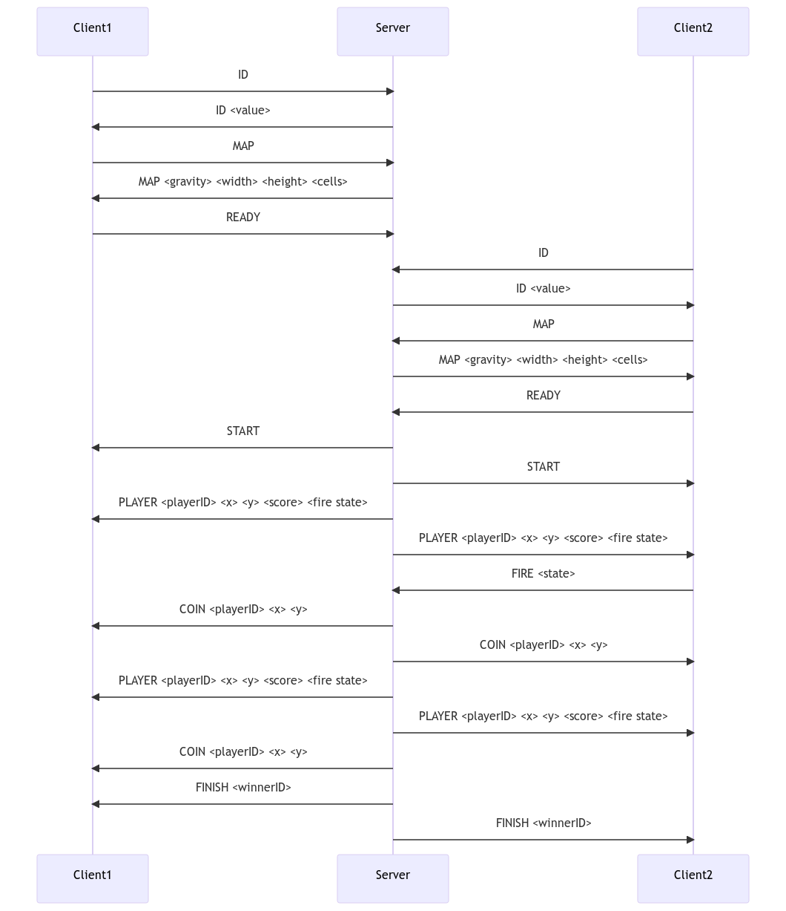

# B4 - Synthesis Pool
## B-SYN-400 - Jetpack to Tech3

Bienvenue sur le projet Jetpack to Tech3. Le but de ce projet est de créer le serveur d'une version multijoueur du jeu Jetpack Joyride.

### Compilation et exécution

Pour compiler le projet, utilisez le fichier Makefile inclus :

```
make
```

Cela créera le binaire nommé "serverJ2T3". Vous pouvez l'exécuter avec les commandes suivantes :

```
./serverJ2T3 -p <port> -g <gravity> -m <map>
```

Vous pouvez également utiliser le client fourni pour se connecter au serveur. Vous pouvez utiliser le flag `-d` pour activer le mode de débogage.

```
./clientJ2T3 -h <ip> -p <port> [-d]
```

Exemple d'utilisation du mode de débogage :

```
./clientJ2T3 -h 127.0.0.1 -p 4242 -d 2>&1 > log.txt
cat log.txt
```

### Protocole du serveur

Le serveur doit être capable d'accepter 2 clients et d'implémenter le protocole suivant :

- ID : le client demande son ID (positif et unique).
- MAP : le client demande la carte.
- READY : le client indique qu'il a reçu son id et la carte et qu'il attend que le jeu commence.
- FIRE : le client informe le serveur du changement d'état du jetpack ('0' si désactivé, '1' si activé).
- START : le serveur indique que les 2 joueurs sont connectés et prêts et que le jeu commence.
- PLAYER : le serveur envoie l'état d'un joueur.
- COIN : le serveur indique qu'un joueur a trouvé une pièce.
- FINISH : le serveur indique que le jeu est terminé et qui est le gagnant.

Chaque message envoyé par le serveur ou le client se termine par un `\n`.

### Gameplay

Le gameplay est basé sur les règles du jeu Jetpack Joyride original avec certaines modifications pour la version multijoueur. Voir les détails dans le document de spécification.

### Exemples

Vous pouvez consulter les exemples de communication entre le client et le serveur, ainsi que les exemples de fichiers de carte, dans le document de spécification.

### Livraison

- Tous les fichiers sources doivent être inclus dans votre livraison, à l'exception de tous les fichiers inutiles (binaires, fichiers temporaires, fichiers obj, etc.).
- Tous les fichiers bonus (y compris un éventuel Makefile spécifique) doivent être dans un répertoire nommé "bonus".
- Les messages d'erreur doivent être écrits sur la sortie d'erreur, et le programme doit alors se terminer avec le code d'erreur 84 (0 s'il n'y a pas d'erreur).

### Diagramme pour les connections serveur-clients

